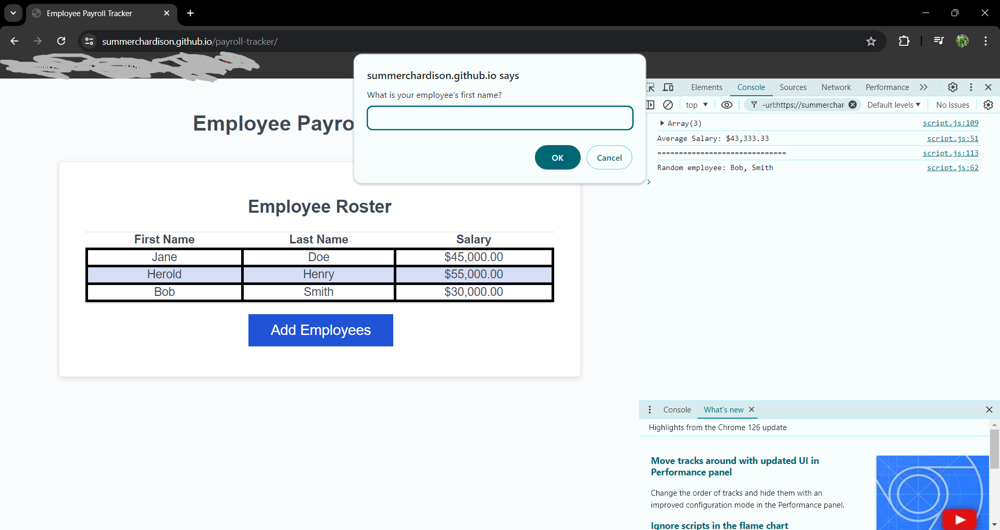

# payroll-tracker

## Description

This web application is a payroll tracker to be used ny employeers as a way to help keep trakc of employee information. It was created to practice working with JavaScript. It was made using JavaScript, HTML, and CSS.

# To application

[https://summerchardison.github.io/payroll-tracker/](https://summerchardison.github.io/payroll-tracker/)

## Credits
Summer Hardison

Thank you to the staff at UNCC for providing me with starter code to complete this project, and to staff as well as my classmates for giving me pointers and helping me work through this and other projects. I could not do it without your support.